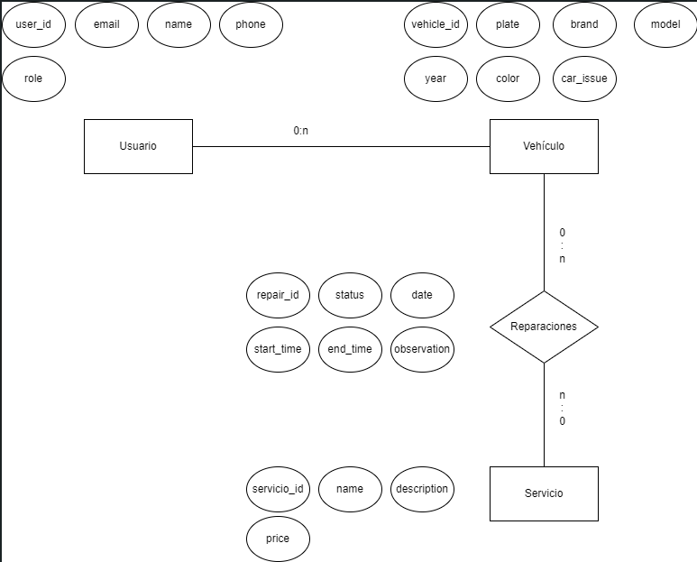
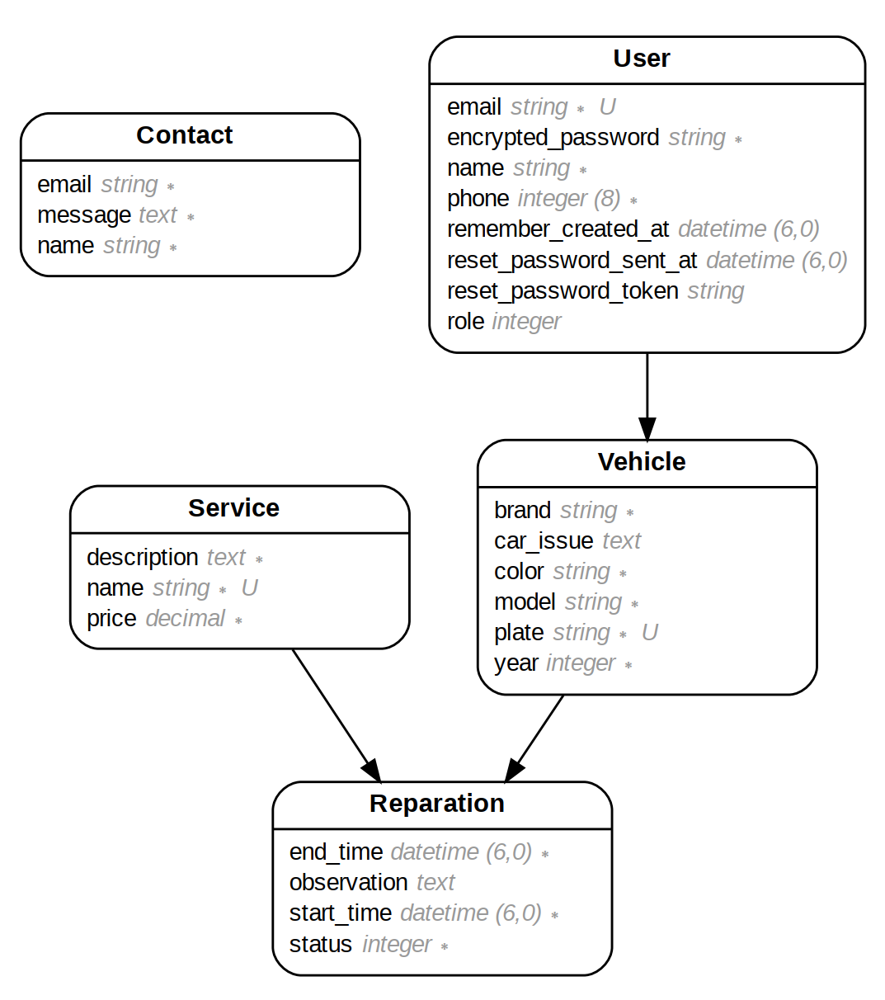
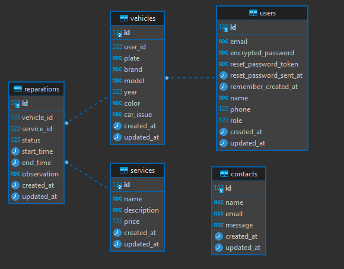

# Taller Mecánico "El Tuercas"

Bienvenido al repositorio del Taller Mecánico "El Tuercas". Este proyecto representa un sistema de gestión integral para un taller mecánico, diseñado para ayudar a organizar y administrar las reparaciones de vehículos de manera eficiente.

## Base de Datos

### Modelo Conceptual



### Modelo Lógico



### Modelo Físico



## Pasos Generales

1. Creación de páginas estáticas home, about
2. Creación de scaffold para contacto
   1. Simular contactos con seeds
3. Creación de modelo de Usuario
   1. Simular usuarios con seeds
4. Creación de vistas de Usuario
5. Creación de modelo de Servicios
   1. Simular servicios con seeds
6. Creación del scaffold de Vehicle
   1. Simular vehículos con seeds
7. Creación de scaffold de Reparaciones
   1. Simular reparaciones con seeds
8. Vistas y controladores.
   1. Restricción de vistas
   2. Paginación
   3. Sólo admin puede crear cuentas de usuario

## Instrucciones específicas

Para el llenado de la base de datos se debe ejercutar cada comando con el siguiente orden:

```bash
    rails db:drop
    rails db:create
    rails db:migrate
    rails runner 'load(File.join(Rails.root, "db", "seeds", "rb", "contacts.rb"))'
    rails runner 'load(File.join(Rails.root, "db", "seeds", "rb", "users.rb"))'
    rails runner 'load(File.join(Rails.root, "db", "seeds", "rb", "services.rb"))'
    rails runner 'load(File.join(Rails.root, "db", "seeds", "rb", "vehicles.rb"))'
    rails runner 'load(File.join(Rails.root, "db", "seeds", "rb", "reparations.rb"))'
```

## Fe de Erratas

El scaffold 'Reparations' debería llamarse 'Repairs' (o similar) fue un lapsus del desarrollador 😅.
